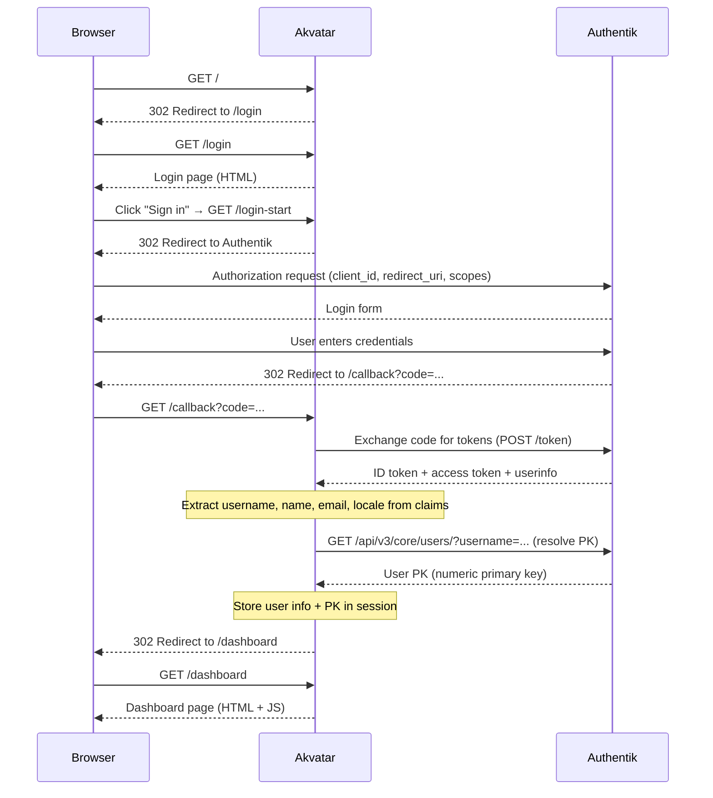
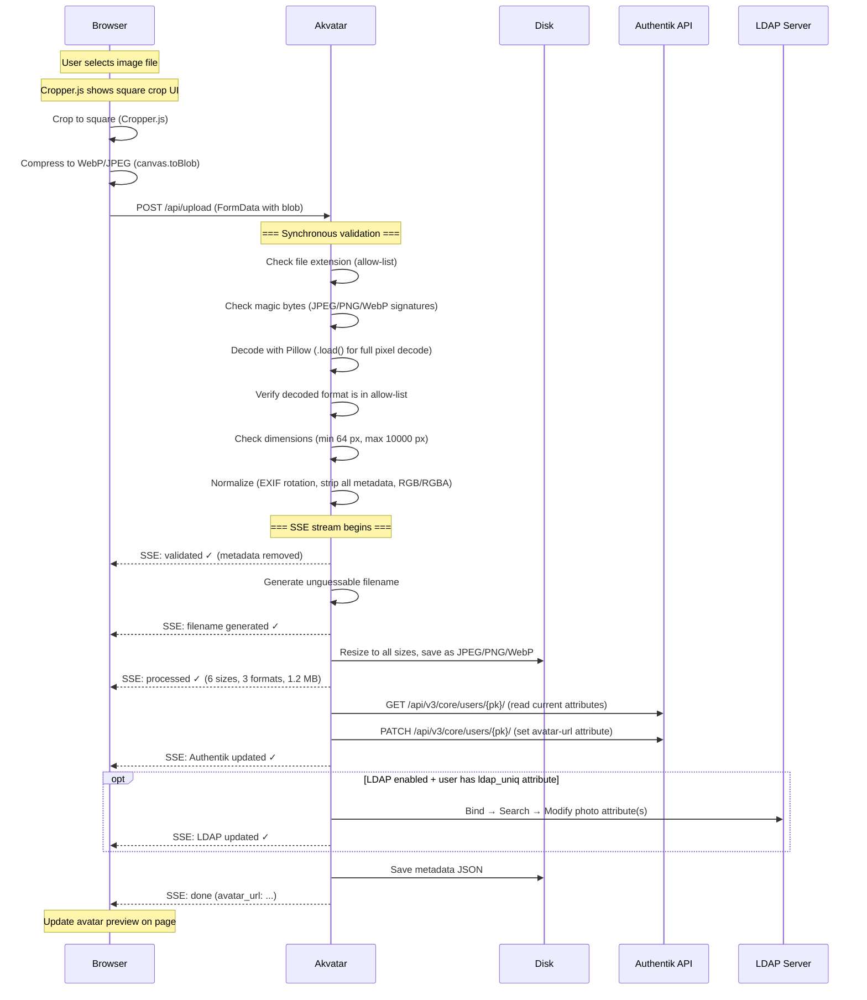
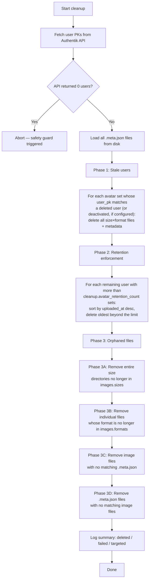

# How It Works

This document explains the complete request lifecycle of Akvatar, from login through avatar
upload to backend synchronization, and how the background cleanup job keeps storage tidy.

## Architecture overview

```text
┌─────────┐                  ┌───────────────┐                  ┌─────────────────────┐
│ Browser │      HTTPS       │ Reverse Proxy │    HTTP/HTTPS    │       Akvatar       │
│         │ ◄──────────────► │ (nginx/Caddy) │ ◄──────────────► │   (Flask/gunicorn)  │
└─────────┘                  └───────────────┘                  └──────────┬──────────┘
                                                                           │
                              ┌────────────────────────────────────────────┼──────────────┐
                              │                                            │              │
                              ▼                                            ▼              ▼
                     ┌─────────────────┐                         ┌──────────────┐  ┌──────────────┐
                     │    Authentik    │                         │     Disk     │  │ LDAP Server  │
                     │  (OIDC + API)   │                         │  (avatars)   │  │  (optional)  │
                     └─────────────────┘                         └──────────────┘  └──────────────┘
```

The application sits behind a reverse proxy and communicates with three backends:

- **Authentik**: OIDC authentication and user attribute updates via the Admin API
- **Disk**: processed avatar images stored in multiple sizes and formats
- **LDAP Server** *(optional)*: writes photo attributes directly into the directory
  (e.g., Active Directory `thumbnailPhoto`)

Static assets (CSS, JS, fonts, images) are served from an **in-memory cache** built
at startup. No disk I/O occurs per request for static files. See
[In-memory static file cache](#in-memory-static-file-cache) for details.

## Authentication flow

The login process uses the standard **OpenID Connect Authorization Code Flow**.



### Key points

- The **PK (primary key)** is resolved once at login and stored in the session. All
  downstream operations (API updates, cleanup matching) use this stable, immutable
  identifier — usernames can change, PKs cannot.
- The **locale** is read from the OIDC `locale` claim. If the user's Authentik profile
  has `locale: de_DE`, the UI switches to German automatically.
- If the OIDC token exchange fails the user is redirected to `/login?error=oidc_failed`. If PK
  resolution fails the error is `/login?error=pk_failed`.
- Adding `?autologin` to the login URL (`/login?autologin`) skips the landing page and
  immediately initiates the OIDC redirect — useful for deep-linking from a portal.

## Upload and processing flow

Once authenticated, the user can upload an avatar. The process involves client-side
preprocessing, server-side validation and processing, and backend synchronization — all
streamed to the browser in real time via Server-Sent Events (SSE).



## Client-side processing (browser)

Before the image reaches the server, the browser performs two steps:

1. **Cropping**: [Cropper.js](https://github.com/fengyuanchen/cropperjs) enforces a
   square crop area. The user can reposition and resize the crop box. The result is
   rendered onto an HTML canvas at the configured maximum dimension
   (see [`images.sizes`](configuration.md#images_sizes)).

2. **Compression**: The canvas is exported via `canvas.toBlob()`. The browser first
   attempts **WebP** (quality 0.85). If WebP encoding is not supported (older browsers),
   it falls back to **JPEG** (quality 0.85). This minimizes upload size while preserving
   quality.

The compressed blob is sent as `multipart/form-data` to `POST /api/upload`.

## Server-side validation

Validation happens **synchronously** before the SSE stream begins. If any check fails the
server returns a JSON error response with HTTP 400 and the browser shows the error inline.

| Check                    | What it catches                                                        | Implementation                                                   |
|--------------------------|------------------------------------------------------------------------|------------------------------------------------------------------|
| File extension           | Blocks unexpected file types early                                     | Allow-list: `.jpg`, `.jpeg`, `.png`, `.webp`                     |
| Magic bytes              | Detects files with fake extensions (e.g. a ZIP renamed to `.jpg`)      | Compares first 12 bytes against known JPEG, PNG, WebP signatures |
| Pillow decode            | Catches corrupt, truncated, or crafted images                          | `Image.open()` + `.load()` (forces full pixel decode)            |
| Format allow-list        | Rejects formats Pillow can decode but we don't handle (e.g. TIFF, BMP) | Checks `image.format` against `{'JPEG', 'PNG', 'WEBP'}`          |
| Dimensions               | Prevents too-small images and too-large ones (excessive CPU/memory)    | Min: 64 px, max: 10 000 px per side                              |
| Decompression bomb limit | Blocks images that expand to extreme pixel counts in memory            | Pillow's `MAX_IMAGE_PIXELS` set to 50 megapixels                 |

## Server-side processing

After validation, the image is normalized and processed:

1. **EXIF orientation**: phone photos store rotation in EXIF metadata rather than
   rotating pixels. `ImageOps.exif_transpose()` applies the rotation to the actual pixel
   data so the image displays correctly on all clients.

2. **Metadata stripping**: the image is rebuilt from raw pixel data
   (`Image.frombytes()`). This discards all EXIF tags, ICC profiles, XMP, IPTC, and any
   other embedded data that could contain PII (GPS coordinates, device model,
   timestamps) or hidden payloads.

3. **Mode normalization**: the image is converted to RGB or RGBA if it is not already.

4. **Resizing**: the normalized image is resized to every configured square size
   (see [`images.sizes`](configuration.md#images_sizes)) using Lanczos resampling.

5. **Multi-format save**: each size is saved in every configured format
   (see [`images.formats`](configuration.md#images_formats)) with configurable quality settings. RGBA images are
   converted to RGB before
   JPEG encoding (JPEG does not support alpha).

## Filename generation

Filenames are designed to be **practically impossible to guess**, preventing URL
enumeration attacks:

```text
{uuid4_hex}-{token_urlsafe(64)}-{nanosecond_timestamp}
```

Example:

```text
a1b2c3d4e5f6a1b2c3d4e5f6a1b2c3d4-Ks8dF2nP...86chars...-1711612800123456789
```

| Component           | Length   | Entropy         |
|---------------------|----------|-----------------|
| `uuid4().hex`       | 32 chars | 128 bits        |
| `token_urlsafe(64)` | 86 chars | ~512 bits       |
| `time_ns()`         | 19 chars | uniqueness only |

## Backend synchronisation

### Authentik API

The app updates the user's avatar URL in Authentik via the Admin API:

1. **Read** current user attributes: `GET /api/v3/core/users/{pk}/`
2. **Merge** the new avatar URL into the existing attributes dict, preserving all other
   custom attributes
3. **Write** the updated dict: `PATCH /api/v3/core/users/{pk}/` with
   `{"attributes": {..., "avatar-url": "<url>"}}`

The URL points to the JPEG at the configured size (see [
`authentik.avatar_size`](configuration.md#authentik_avatar_size)). Authentik
uses this URL to display the avatar in its UI (login portals, admin panel, etc.).

See [Authentik API Token](authentik-api-token.md) for setup instructions.

### LDAP Server (optional)

When LDAP is enabled the app writes avatar data into one or more LDAP attributes as
defined in the `ldap.photos` configuration:

1. **Prepare** each configured photo attribute — reuse a pre-generated file if the exact
   size and format exists and fits within `max_file_size`; otherwise resize from the
   closest larger source and reduce JPEG/WebP quality iteratively until the output fits.
   PNG cannot be quality-reduced (lossless) — a `ValueError` is raised if it exceeds the
   limit.
2. **Bind** to the LDAP server as the configured service account
3. **Search** for the user under `search_base` using `search_filter` (default:
   `(objectSid={ldap_uniq})` for Active Directory); the `{ldap_uniq}` placeholder is
   replaced with the value from the user's Authentik attributes and is properly
   LDAP-filter-escaped to prevent injection.
4. **Modify** all configured attributes in a single LDAP operation — `binary` attributes
   receive raw image bytes, `url` attributes receive the public file URL as a string
5. **Unbind**

The `ldap_uniq` value comes from the user's Authentik attributes (read during the
Authentik API call). Users without `ldap_uniq` are Authentik-only accounts and the LDAP
step is skipped automatically.

See [MS AD Service Account](ms-ad-service-account.md) for setting up a least-privilege
service account in Active Directory.

## Rollback on failure

If either backend update (Authentik API or LDAP) fails:

1. All generated image files (every size × format combination) are deleted from disk
2. The metadata JSON is deleted
3. The browser receives an error SSE event with the failure detail
4. The user sees an error message and can retry immediately

This ensures no orphaned files accumulate from failed uploads.

## Metadata storage

A JSON metadata file is saved alongside each avatar set in
`data/user-avatars/_metadata/`:

```json
{
  "filename": "a1b2c3d4...-1711612800123456789",
  "user_pk": 42,
  "uploaded_at": "2025-03-28T12:00:00+00:00",
  "sizes": [
    1024,
    648,
    512,
    256,
    128,
    64
  ],
  "formats": [
    "jpg",
    "png",
    "webp"
  ],
  "authentik_avatar_url": "https://avatar.example.com/user-avatars/1024x1024/a1b2c3d4....jpg",
  "total_bytes": 1258000
}
```

The metadata is the authoritative source of ownership — the `user_pk` field links each
avatar set to an Authentik user and is used by the cleanup job.

## Avatar storage layout

```text
data/user-avatars/
├── 1024x1024/
│   ├── {filename}.jpg
│   ├── {filename}.png
│   └── {filename}.webp
├── 648x648/
│   ├── ...
├── 512x512/
│   ├── ...
├── 256x256/
│   ├── ...
├── 128x128/
│   ├── ...
├── 64x64/
│   ├── ...
└── _metadata/
    └── {filename}.meta.json
```

Each upload produces one image file per configured size per format, plus one metadata file
(see [`images.sizes`](configuration.md#images_sizes) and [`images.formats`](configuration.md#images_formats)).

## Cleanup

The cleanup job runs in a background daemon thread on a configurable cron schedule
(see [`cleanup.interval`](configuration.md#cleanup_interval)). It can also be triggered manually via
`python run_cleanup.py`.

### Why cleanup is needed

Every successful upload writes multiple files to disk (one per configured size and format, plus metadata). Over
time this accumulates from:

- Users who have since been deleted from Authentik (and optionally deactivated, if [
  `cleanup.when_user_deactivated`](configuration.md#cleanup_when_user_deactivated) is enabled)
- Users who have uploaded multiple times (only the latest few are needed)
- Leftover files from configuration changes (e.g., removed sizes or formats)

### Safety guard

Before doing anything, the cleanup job calls the Authentik API to fetch all active user
PKs. If the API returns **zero users** (possible if the token expired or the network is
unreachable), the entire job is aborted. This prevents catastrophic mass deletion from an
API outage being mistaken for "no users exist".

### Cleanup phases



#### Phase 1 — Stale users

Reads the `user_pk` from every `.meta.json` file and compares it against user data
fetched from Authentik. Which users trigger cleanup is controlled by two flags:

- [`cleanup.when_user_deleted`](configuration.md#cleanup_when_user_deleted) (default `true`): removes avatar sets for
  users
  whose PK no longer exists in Authentik at all.
- [`cleanup.when_user_deactivated`](configuration.md#cleanup_when_user_deactivated) (default `false`): also removes
  avatar sets
  for users that exist in Authentik but are currently deactivated.

For every targeted user, all size × format image files and the metadata file are deleted.

#### Phase 2 — Retention enforcement

For each user not targeted by Phase 1, avatar sets are sorted newest-first by `uploaded_at`
(ISO 8601 sorts lexicographically). Sets beyond the configured
[`cleanup.avatar_retention_count`](configuration.md#cleanup_avatar_retention_count) are deleted.

#### Phase 3 — Orphaned files

Handles leftovers from configuration changes:

- **3A**: Entire size directories (e.g. `512x512/`) that are no longer in `images.sizes`
  are removed with `shutil.rmtree`.
- **3B**: Individual image files whose extension is no longer in `images.formats` are
  deleted (e.g. `.png` files when PNG was removed from the config).
- **3C**: Image files inside a valid size directory that have no corresponding
  `.meta.json` are deleted (e.g., partial uploads cleaned up after a crash).
- **3D**: `.meta.json` files that have no matching image files on disk are deleted
  (e.g., metadata left behind after manual file removal).

### Cleanup summary log

At the end of each run, one summary line is logged:

```text
# Normal run — everything succeeded
Cleanup complete: 42 file(s) deleted.

# Partial failures
Cleanup complete: 40 deleted, 2 failed (42 targeted).

# Dry-run mode
Cleanup complete: would remove ~54 file(s) (3 avatar set(s), 0 orphan(s)).

# Nothing to do
Cleanup complete: nothing to remove.
```

In dry-run mode (`dry_run: true` in config), no files are touched — the job logs exactly
what it would have done. The file count for avatar sets in dry-run is an estimate
(`sets × (sizes × formats + 1)`).

### Cleanup configuration

| Setting                                                                             | Description                                    |
|-------------------------------------------------------------------------------------|------------------------------------------------|
| [`cleanup.interval`](configuration.md#cleanup_interval)                             | Cron schedule (UTC) for when the job runs      |
| [`cleanup.on_startup`](configuration.md#cleanup_on_startup)                         | Whether to also run once shortly after startup |
| [`cleanup.avatar_retention_count`](configuration.md#cleanup_avatar_retention_count) | How many avatar sets to keep per user          |
| [`cleanup.when_user_deleted`](configuration.md#cleanup_when_user_deleted)           | Remove avatars of users deleted from Authentik |
| [`cleanup.when_user_deactivated`](configuration.md#cleanup_when_user_deactivated)   | Remove avatars of deactivated Authentik users  |
| [`dry_run`](configuration.md#dry_run)                                               | Log-only mode — no files are deleted           |

## Server-Sent Events (SSE)

The upload endpoint returns a `text/event-stream` response that pushes one JSON frame per
processing step:

```text
POST /api/upload → Content-Type: text/event-stream

data: {"step": "Image validated & loaded",                   "status": "success", "detail": "Image metadata removed"}
data: {"step": "Filename generated",                         "status": "success"}
data: {"step": "Image processed & saved in all sizes/formats","status": "success", "detail": "6 sizes, 3 formats, 1.2 MB"}
data: {"step": "Login Portal Photo updated",                 "status": "success"}
data: {"step": "User Directory Photo updated",               "status": "success"}
data: {"done": true, "avatar_url": "https://..."}
```

Each `status` is one of:

| Status    | Meaning                                              |
|-----------|------------------------------------------------------|
| `success` | Step completed successfully                          |
| `failed`  | Step failed; a rollback will follow                  |
| `skipped` | Step was intentionally skipped (e.g. no `ldap_uniq`) |
| `dry-run` | Step was simulated but no actual change was made     |

The browser renders these as a checklist with color-coded icons. The final `done` frame
carries either `avatar_url` (success) or `error` (failure).

## Health check endpoint

`GET /healthz` returns `200 OK` with body `OK`. It performs no authentication, no
database access, and no external calls — it only confirms that the gunicorn worker
process is alive and accepting connections.

Use it with Docker, Kubernetes, or any load balancer that needs a lightweight liveness
probe. The endpoint is never rate-limited.

## In-memory static file cache

All files under `static/` (CSS, JS, fonts, images) are read from disk once at import
time and stored in a module-level dictionary. Subsequent requests are served entirely
from RAM. With `gunicorn --preload`, workers inherit the populated cache via `fork` so
no worker needs to perform disk reads.

Each cached entry stores the raw bytes, the MIME type, and a 16-character SHA-256
prefix used as the ETag. Requests with a matching `If-None-Match` header receive a
`304 Not Modified` without copying any data. A 1-day `Cache-Control: public,
max-age=86400` header instructs browsers to cache assets locally.

## Security measures

| Measure                           | Purpose                                                                            |
|-----------------------------------|------------------------------------------------------------------------------------|
| Unguessable filenames             | Prevents URL enumeration of other users' avatars                                   |
| Magic byte verification           | Blocks files with fake extensions before they reach the image decoder              |
| Decompression bomb limit (50 MP)  | Prevents memory exhaustion from crafted small-on-disk, huge-in-memory images       |
| Dimension limits (64–10 000 px)   | Guards against excessive CPU/memory use during resizing                            |
| Format allow-list                 | Only JPEG, PNG, WebP are processed — no TIFF, BMP, SVG, GIF, etc.                 |
| Metadata stripping                | Removes EXIF (GPS, device info), ICC profiles, XMP, and other embedded PII         |
| CSRF protection                   | Per-session token validated via `X-CSRF-Token` header on all state-changing requests using `secrets.compare_digest()` |
| SSRF protection                   | URL import (`import.url_enabled`) validates hosts against a configurable allow-list before fetching |
| Rate limiting                     | Login and upload endpoints are rate-limited per IP to prevent brute-force and abuse |
| Client-side session liveness      | Dashboard polls `/api/session` every 60 s; redirects to login page before form submission if session expired |
| LDAP filter escaping              | `ldap_uniq` value is escaped via `escape_filter_chars()` to prevent LDAP injection |
| Flask session signing             | Session cookies are cryptographically signed with `app.secret_key`                 |
| Session cookie hardening          | `HttpOnly`, `SameSite=Lax`, `Secure` (auto-set from `public_base_url`) flags set   |
| Security response headers         | `X-Content-Type-Options: nosniff`, `X-Frame-Options: DENY` (HTML), and             |
|                                   | `Referrer-Policy: strict-origin-when-cross-origin` on every response               |
| Cleanup safety guard              | Aborts if Authentik returns zero users — prevents mass deletion on API failure     |
| Non-root Docker container         | Runs as UID 65532 with no shell in a distroless image                              |
| Read-only root filesystem         | Container filesystem is immutable; only data volumes are writable                  |
| Dropped capabilities              | `cap_drop: ALL` removes all Linux capabilities from the container                  |
