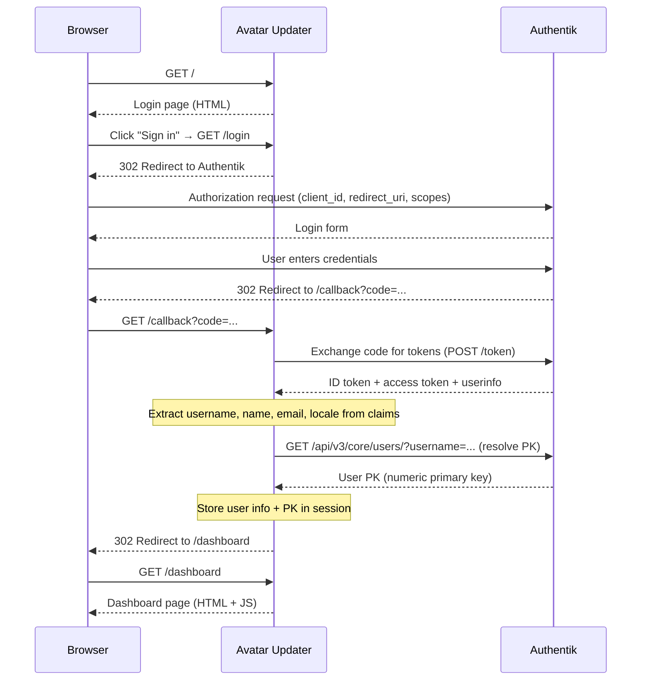
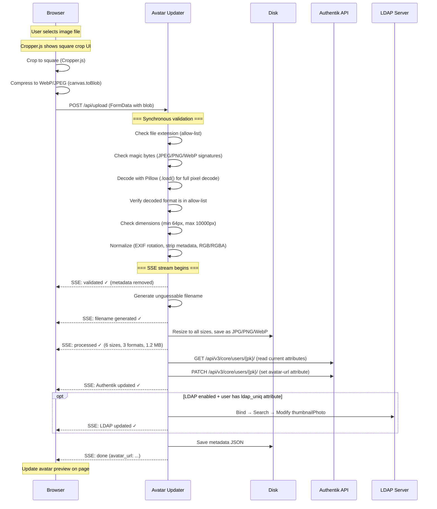

# How It Works

This document explains the complete request lifecycle of the Authentik Avatar Updater -- from login through avatar upload to backend synchronisation.

## Architecture overview

```
┌─────────┐      HTTPS       ┌───────────────┐       HTTP        ┌─────────────────────┐
│ Browser  │ ◄──────────────► │ Reverse Proxy │ ◄──────────────►  │   Avatar Updater    │
│          │                  │ (nginx/Caddy)  │                  │   (Flask/gunicorn)   │
└─────────┘                  └───────────────┘                  └──────────┬──────────┘
                                                                           │
                              ┌────────────────────────────────────────────┼────────────────┐
                              │                                            │                │
                              ▼                                            ▼                ▼
                     ┌─────────────────┐                         ┌──────────────┐  ┌──────────────┐
                     │    Authentik     │                         │     Disk     │  │ LDAP Server  │
                     │  (OIDC + API)   │                         │  (avatars)   │  │  (optional)  │
                     └─────────────────┘                         └──────────────┘  └──────────────┘
```

The application sits behind a reverse proxy and communicates with three backends:
- **Authentik** -- for OIDC authentication and user attribute updates via the Admin API
- **Disk** -- for storing processed avatar images in multiple sizes and formats
- **LDAP Server** (optional) -- for writing the photo attribute directly into the directory (e.g. Active Directory `thumbnailPhoto`)

## Authentication flow

The login process uses the standard **OpenID Connect Authorization Code Flow**.



### Key points

- The **PK (primary key)** is resolved at login time so that all downstream operations use a stable, immutable identifier. Usernames can change; PKs cannot.
- The **locale** is read from the OIDC `locale` claim and stored in the session. If the user's Authentik profile has `locale: de_DE`, the UI switches to German.
- If the OIDC token exchange fails, the user is redirected to the login page with `?error=oidc_failed`. If the PK resolution fails, the error is `?error=pk_failed`.

## Upload and processing flow

Once authenticated, the user can upload an avatar. The process involves client-side preprocessing, server-side validation and processing, and backend synchronisation -- all streamed to the browser in real time via Server-Sent Events (SSE).



## Client-side processing (browser)

Before the image reaches the server, the browser performs two steps:

1. **Cropping** -- [Cropper.js](https://github.com/fengyuanchen/cropperjs) enforces a **square** crop area. The user can reposition and resize the crop box. The cropped result is rendered onto an HTML canvas at the server's maximum configured dimension (default: 1024x1024).

2. **Compression** -- the canvas is exported as a blob using `canvas.toBlob()`. The browser first attempts **WebP** (quality 0.85). If WebP encoding is not supported (older browsers), it falls back to **JPEG** (quality 0.85). This minimises upload size while preserving quality.

The compressed blob is sent as a `multipart/form-data` POST to `/api/upload`.

## Server-side validation

Validation happens **synchronously** before the SSE stream begins. If any check fails, the server returns a JSON error response with HTTP 400 -- the browser shows the error inline.

| Check | What it catches | Implementation |
|---|---|---|
| File extension | Blocks unexpected file types early | Allow-list: `.jpg`, `.jpeg`, `.png`, `.webp` |
| Magic bytes | Detects files with fake extensions (e.g. `.jpg` that is actually a ZIP) | Compares first bytes against known JPEG, PNG, WebP signatures |
| Pillow decode | Catches corrupt, truncated, or crafted images | `Image.open()` + `.load()` (forces full pixel decode) |
| Format allow-list | Rejects images Pillow can decode but we don't intend to handle (e.g. TIFF, BMP) | Checks `image.format` against `{'JPEG', 'PNG', 'WEBP'}` |
| Dimensions | Prevents too-small images (useless as avatars) and too-large ones (excessive CPU/memory) | Min: 64px, max: 10000px per side |
| Decompression bomb | Blocks images that expand to extreme pixel counts in memory | Pillow's `MAX_IMAGE_PIXELS` set to 50 megapixels |

## Server-side processing

After validation, the image is normalised and processed:

1. **EXIF orientation** -- phone photos store rotation in EXIF metadata rather than rotating pixels. `ImageOps.exif_transpose()` applies the rotation to the actual pixel data.

2. **Metadata stripping** -- the image is rebuilt from raw pixel data (`Image.frombytes()`). This discards all EXIF, ICC profiles, XMP, IPTC, and any other metadata that could contain PII (GPS coordinates, device model, timestamps) or hidden payloads.

3. **Mode normalisation** -- the image is converted to RGB or RGBA if it isn't already.

4. **Resizing** -- the normalised image is resized to every configured square size (default: 1024, 648, 512, 256, 128, 64) using Lanczos resampling.

5. **Multi-format save** -- each size is saved in every configured format (default: JPEG, PNG, WebP) with configurable quality settings.

## Filename generation

Filenames are designed to be **practically impossible to guess**, preventing URL enumeration attacks:

```
{uuid4_hex}-{token_urlsafe(64)}-{nanosecond_timestamp}
```

Example: `a1b2c3d4e5f6a1b2c3d4e5f6a1b2c3d4-Ks8dF2nP...64chars...-1711612800123456789`

Components:
- `uuid4().hex` -- 32 hex characters (128 bits of randomness)
- `token_urlsafe(64)` -- 86 URL-safe characters (~512 bits of randomness)
- `time_ns()` -- nanosecond timestamp (adds uniqueness, not security)

## Backend synchronisation

### Authentik API

The app updates the user's avatar URL in Authentik via the Admin API:

1. **Read** current attributes: `GET /api/v3/core/users/{pk}/`
2. **Merge** the avatar URL into the existing attributes dict (preserving all other custom attributes)
3. **Write** the updated attributes: `PATCH /api/v3/core/users/{pk}/` with `{"attributes": {..., "avatar-url": "<url>"}}`

The avatar URL points to the canonical JPEG at the configured size (default: 1024x1024). Authentik uses this URL to display the user's avatar across its UI (login portals, admin panel, etc.).

See [Authentik API Token](authentik-api-token.md) for setup instructions.

### LDAP Server (optional)

When LDAP is enabled, the app writes the avatar as a JPEG binary blob directly into the user's LDAP object:

1. **Bind** to the LDAP server as the configured service account
2. **Search** for the user under `search_base` using `search_filter` (default: `(objectSid={ldap_uniq})` for Active Directory)
3. **Modify** the `photo_attribute` (default: `thumbnailPhoto`) with the JPEG bytes of the configured thumbnail size (default: 128x128)
4. **Unbind**

The `ldap_uniq` value comes from the user's Authentik attributes (read during the Authentik API call). Users without `ldap_uniq` are Authentik-only accounts and the LDAP step is skipped.

See [MS AD Service Account](ms-ad-service-account.md) for setting up a least-privilege service account in Active Directory.

## Rollback on failure

If either backend update (Authentik API or LDAP) fails:

1. All generated image files (every size x format combination) are deleted from disk
2. The metadata JSON is deleted
3. The browser receives an error SSE event
4. The user sees an error message and can retry

This ensures no orphaned files accumulate from failed uploads.

## Metadata storage

A JSON metadata file is saved alongside each avatar set:

```json
{
  "filename": "a1b2c3d4...-1711612800123456789",
  "user_pk": 42,
  "uploaded_at": "2025-03-28T12:00:00+00:00",
  "sizes": [1024, 648, 512, 256, 128, 64],
  "formats": ["jpg", "png", "webp"],
  "authentik_avatar_url": "https://avatar.example.com/user-avatars/1024x1024/a1b2c3d4....jpg",
  "total_bytes": 1258000
}
```

Metadata files are stored in `data/user-avatars/_metadata/` and are used by the cleanup job to determine ownership (which user PK owns which avatar set).

## Cleanup

The cleanup job runs on a configurable cron schedule (default: daily at 2 AM) and performs two phases:

1. **Orphan removal** -- compares avatar ownership (from metadata files) against the list of active Authentik users. Avatars belonging to deleted or deactivated users are removed.

2. **Retention enforcement** -- for each active user, keeps only the N most recent avatar sets (configurable via `app.avatar_retention_count`, default: 2). Older uploads are automatically deleted.

See [Configuration Reference](configuration.md#appcleanup_interval) for schedule and retention settings.

## Server-Sent Events (SSE)

The upload endpoint uses SSE to stream progress to the browser in real time. This provides immediate visual feedback for each processing step without polling.

```
POST /api/upload → Response: text/event-stream

data: {"step": "Image validated & loaded", "status": "success", "detail": "Image metadata removed"}

data: {"step": "Filename generated", "status": "success"}

data: {"step": "Image processed & saved in all sizes/formats", "status": "success", "detail": "6 sizes, 3 formats, 1.2 MB"}

data: {"step": "Login Portal Photo updated", "status": "success"}

data: {"step": "User Directory Photo updated", "status": "success"}

data: {"done": true, "avatar_url": "https://..."}
```

Each step has a `status` field: `success`, `failed`, `skipped`, or `dry-run`. The browser renders these as a checklist with colour-coded icons. The final `done` event carries either the new `avatar_url` (success) or an `error` message (failure).

## Security measures

| Measure | Purpose |
|---|---|
| Unguessable filenames | Prevents URL enumeration of other users' avatars |
| Magic byte verification | Blocks files with fake extensions before they reach the image decoder |
| Pillow decompression bomb limit (50 MP) | Prevents memory exhaustion from crafted small-on-disk, huge-in-memory images |
| Dimension limits (64--10000 px) | Guards against excessive CPU/memory use during resizing |
| Format allow-list | Only JPEG, PNG, WebP are processed -- no TIFF, BMP, SVG, etc. |
| Metadata stripping | Removes EXIF (GPS, device info), ICC profiles, XMP, and other embedded data that could leak PII |
| Flask session signing | Session cookies are cryptographically signed with `app.secret_key` |
| Non-root Docker container | Application runs as UID 65532 with no shell in a distroless image |
| Read-only root filesystem | Container filesystem is immutable; only data volumes are writable |
| Dropped capabilities | `cap_drop: ALL` removes all Linux capabilities from the container |
