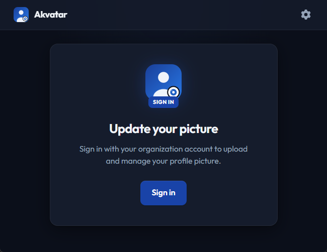
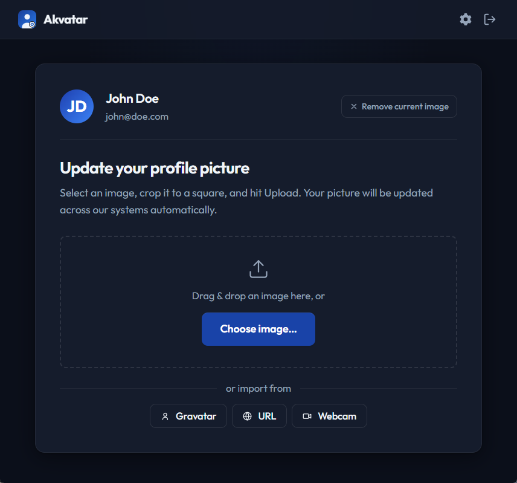
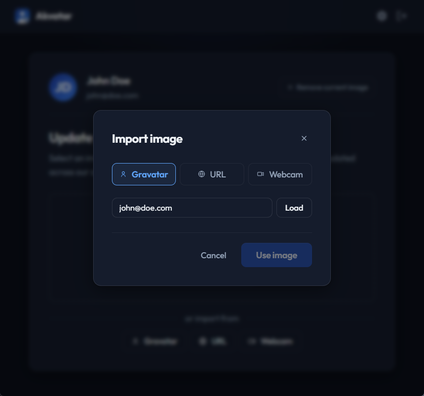
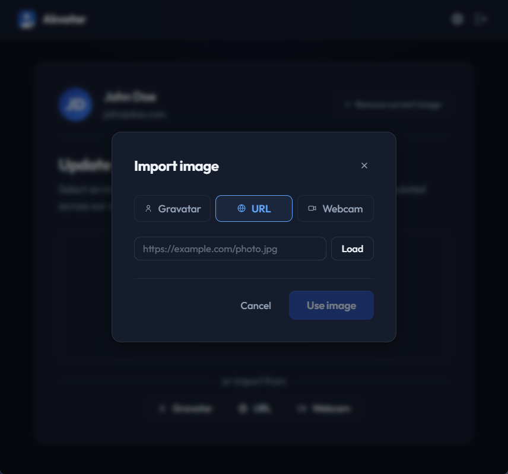
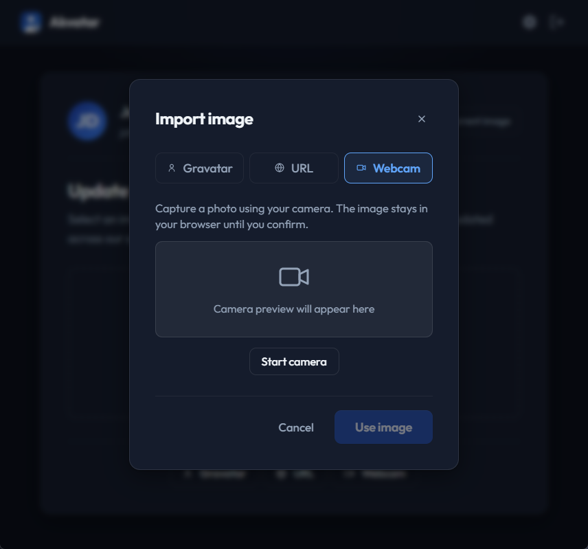
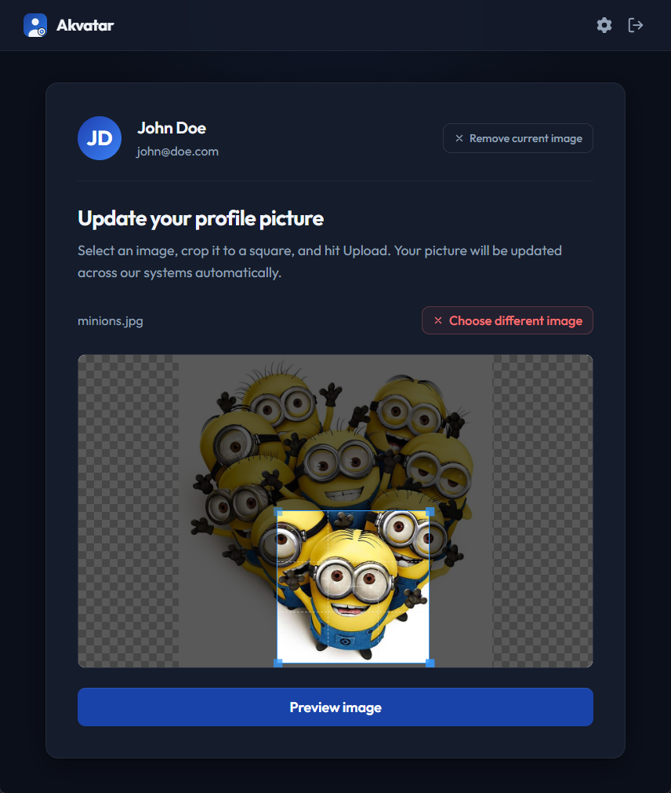
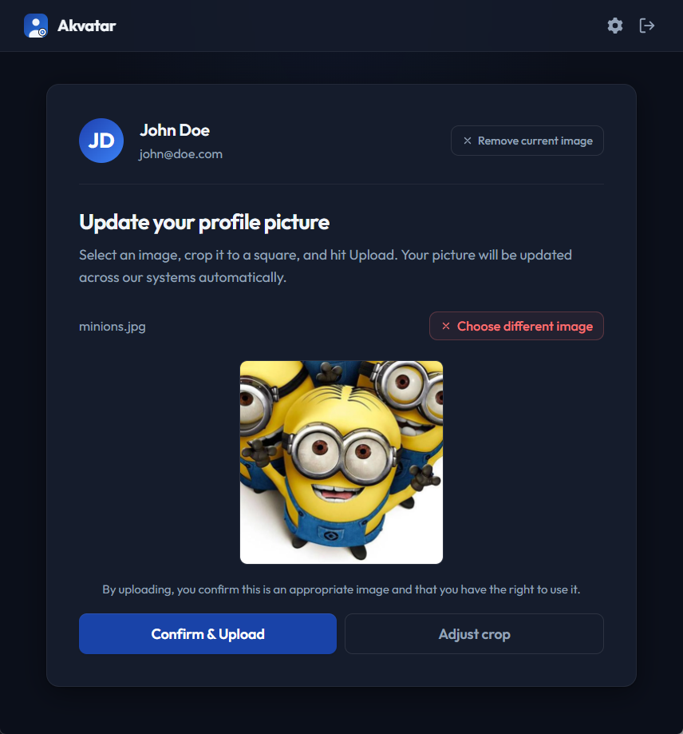
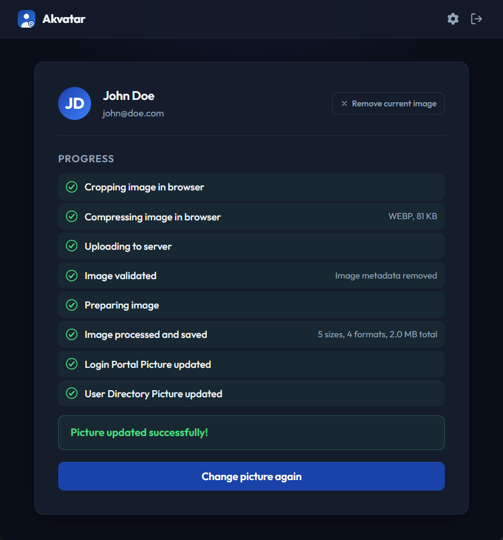
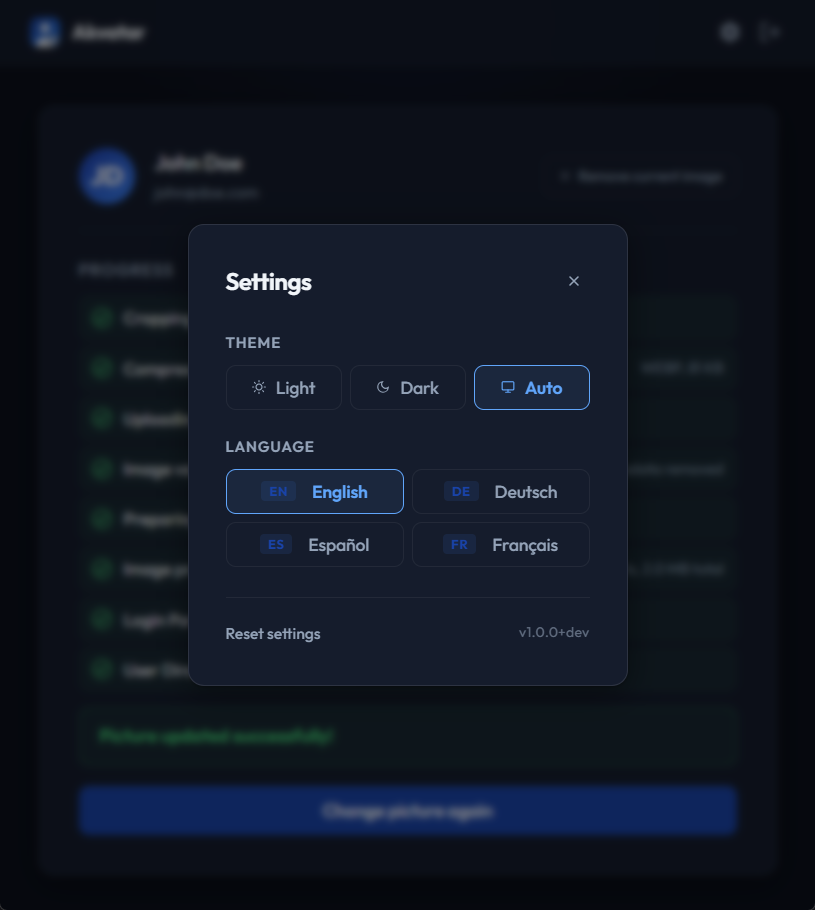

# Screenshots

A visual tour of Akvatar, from sign-in to a fully uploaded avatar. Each section
below captures one step of the typical user flow, so you can scroll through and
get a feel for the UI, the available options, and what happens behind the
scenes, without installing anything.

## 1. Sign in

Users land on a minimal sign-in page and authenticate through Authentik using
the OpenID Connect Authorization Code Flow. Akvatar does not store any local
accounts or passwords; the "Sign in" button simply redirects to the configured
Authentik provider, and after a successful login the user is sent back with an
active session. The UI language is resolved from the OIDC `locale` claim, so
German, French, or Spanish users see the app in their own language on first
visit.

## 2. Dashboard

After login, the dashboard shows the user's display name, email, and current
profile picture alongside the import controls. From here the user can provide a
new avatar in four ways: uploading a local file, importing from Gravatar,
importing from a public image URL, or capturing a photo with the webcam. Each
source is individually toggleable in `config.yml`, so administrators can hide
options they do not want to expose. A live session heartbeat runs in the
background and redirects to the login page with a clear notice if the session
expires before submission.

## 3. Import sources

Akvatar supports multiple ways to bring in an image. Which tabs appear on the
dashboard depends on the enabled sources in the configuration, so a minimal
deployment can restrict users to file upload only while a more permissive setup
exposes all four.

### 3a. Import from Gravatar

The user types an email address and Akvatar fetches the matching Gravatar image
directly in the browser. The result is handed straight to the cropper, so no
intermediate copy is stored on the server if the user then cancels. This is the
fastest way for users who already maintain a Gravatar identity.

### 3b. Import from URL

The user pastes any public image URL and the browser loads it into the cropper.
The fetch happens client-side, meaning Akvatar's server never sees the source
URL or acts as a proxy for arbitrary external requests. This is convenient for
pulling a picture from an existing profile on another service.

### 3c. Import from webcam

The user grants camera access and takes a fresh photo directly in the browser.
A live preview is shown before the snapshot is taken, and the captured frame is
then passed to the cropper just like any other source. Useful for spontaneous
profile updates without having to transfer a photo from a phone first.

## 4. Crop the image

Once an image is loaded from any source, Cropper.js presents a square selection
that the user can drag, resize, and reposition over the source image. The
square aspect ratio is enforced so that all downstream sizes render correctly
regardless of the original dimensions. All cropping happens client-side; the
full, uncropped original never leaves the browser, which keeps unused pixels
off the server.

## 5. Preview before upload

Before anything is sent to the server, the user sees a final preview of the
cropped result at avatar proportions. This is the last confirmation step: the
user can either accept and proceed to upload, or go back and re-crop if the
framing is off. The preview image is generated locally from the cropped canvas
via `canvas.toBlob()`, so it matches exactly what the server will receive.

## 6. Upload progress and result

On confirmation, the cropped image is uploaded to `POST /api/upload` and a live
Server-Sent Events stream reports each processing step in real time. The user
can see validation (extension, magic bytes, Pillow decode, dimensions),
metadata stripping (EXIF, GPS, ICC, XMP, IPTC), encoding into every configured
size and format (JPEG, PNG, WebP, and optionally AVIF), the Authentik Admin
API update, and the optional LDAP write, each marked as success, failed,
skipped, or dry-run. Once the stream completes, the dashboard refreshes to show
the newly uploaded avatar.

## 7. Settings

The settings page gives users a place to review their account details and
manage their current avatar. The most important action here is "remove avatar",
which clears the image from Authentik (and LDAP, if configured) via a one-click
confirmation dialog and resets the user to the Authentik default. This is the
counterpart to the upload flow for users who want to opt back out of having a
custom picture.

